```{=typst}
#set page(
  footer: context {
    grid(
      columns: (1fr, 1fr),
      align: (left + bottom, right + bottom),
      // Left side: Text and signature image overlay
      [
        #set text(size: 9pt)
        Authorized Signature: \
        #place(top + left, dx: 3cm, dy: -25pt)[
          #image("images/signature.png", width: 5.5cm) // Path to your PNG
        ]
        #box(width: 6cm, stroke: (bottom: 0.5pt))
      ],
      // Right side: Date line
      [
        #set text(size: 9pt)
        Date: 3 July 2026
      ]
    )
  }
)

```

```{=typst}
#line(length: 100%)
***All SARA Activities during Year 2024-25***
#line(length: 100%)
```

During the year 2024-25, we gave free education to 87 students through our offline courses.

# 2024-25 SARA Courses

## July 2024: 1st SARA Summer School - R for Researchers

The 1st SARA Data Science Summer School, held in the **22-26 July 2024**. This week-
long program brought together **18** (see @fig-summer-group) aspiring data enthusiasts, students, and professionals from diverse backgrounds to dive deep into the fundamentals and advanced applications of data science.

Participants explored key topics such as data visualization, and data wrangling, while also gaining exposure to R programming language. The program not only enhanced technical skills but also cultivated a collaborative learning environment, empowering attendees to tackle future challenges in the data-driven world with confidence with the help of international expert speakers, see @fig-speakers-summer.

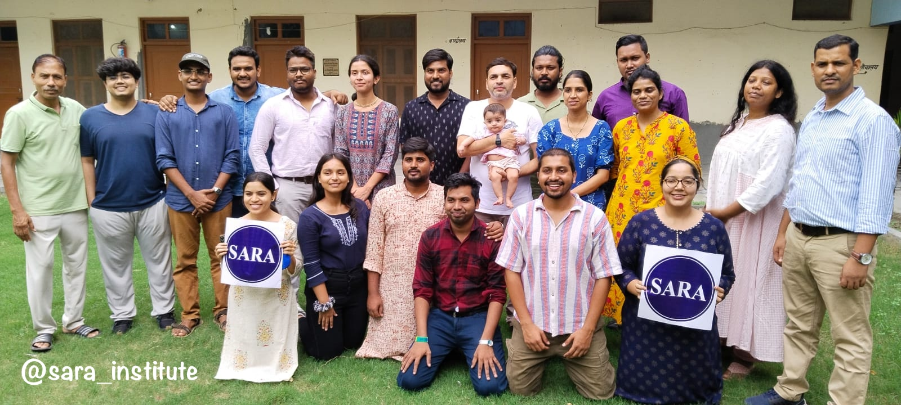{#fig-summer-group}

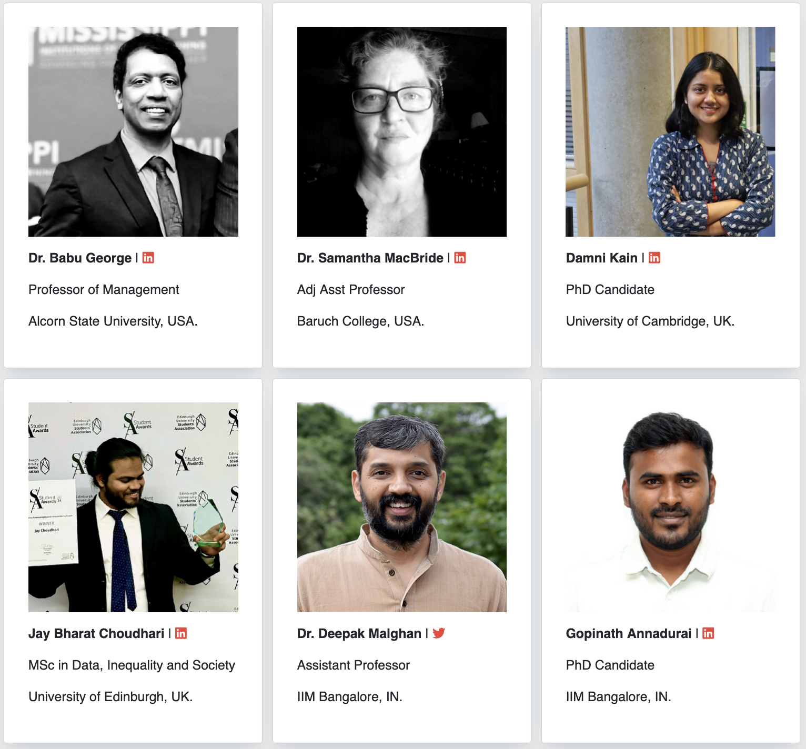{#fig-speakers-summer width="50%"}

::: {.callout-note title="📺 Watch on YouTube"}

Participants Feedback video link: <https://youtu.be/Yh5GaURxfXA?si=a7z3BLAxiCB3Vf-X>

:::

## Dec 2024: 1st SARA Winter School: Statistics Using R  

The SARA Data Science Winter School on Statistics Using R was a transformative program designed to equip **11 participants** (see @fig-winter-group) with essential statistical knowledge and practical skills for data analysis. Held in **16-20 December 2024**, this intensive course focused on using R, a powerful open-source software, to perform statistical modeling, hypothesis testing, data visualization, and exploratory data analysis.

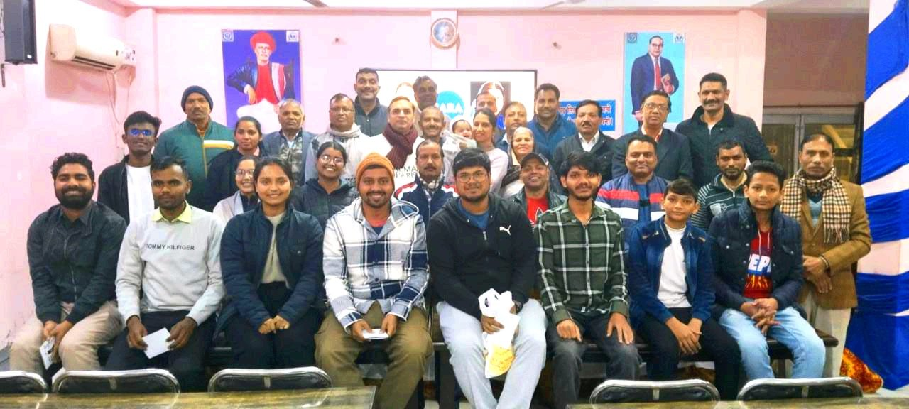{#fig-winter-group width="70%"}

## March 2025: 1st SARA Bootcamp - Publish using Quarto

We have also conducted residential five days (3-7 March 2025) 1st SARA Data Science Bootcamp - "Publish using Quarto". It was attended by 10 participants, see @fig-march-group. It included website development, thesis writing, and publishing workflows. These include training in GitHub for version control and collaboration, and Quarto for creating dynamic, reproducible documents and websites. These skills are essential for modern academic and professional publishing.

{#fig-march-group width="70%"}

::: {.callout-note title="📺 Watch on YouTube"}

Participants Feedback video link: <https://youtu.be/ytENYufsDro?si=W8Wo9fRkd8MdLry9>

:::

## Computer & English Courses

SARA is proud to offer **free Computer and English courses** aimed at empowering students with essential skills for the modern world. These classes run through out the year, held Monday to Friday for two hours each day, are open to any student from **Class 8 and above**, see @fig-eng-class.

Simultaneously, the English classes focus on enhancing communication skills, grammar, vocabulary, and confidence in spoken and written English. By providing these free courses, SARA aims to bridge the digital and linguistic divide, ensuring that students from all backgrounds have the tools they need to thrive in academics and beyond.

::: {#fig-courses layout-ncol=2}

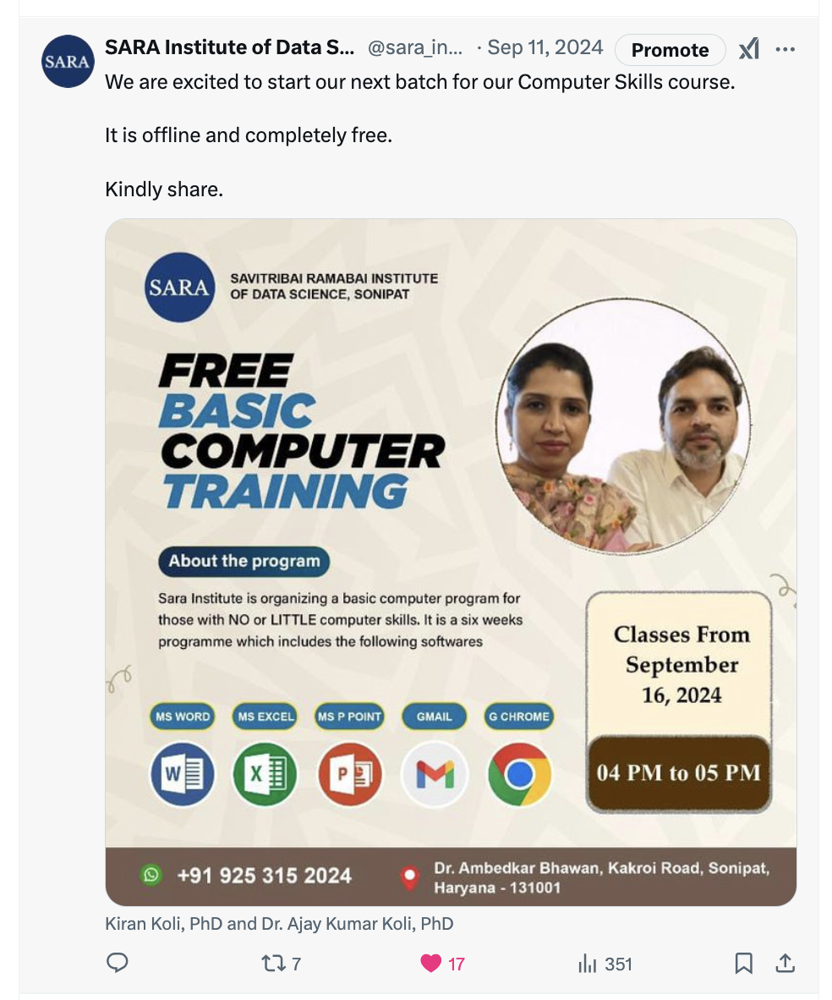{#fig-course-sept width="70%"}

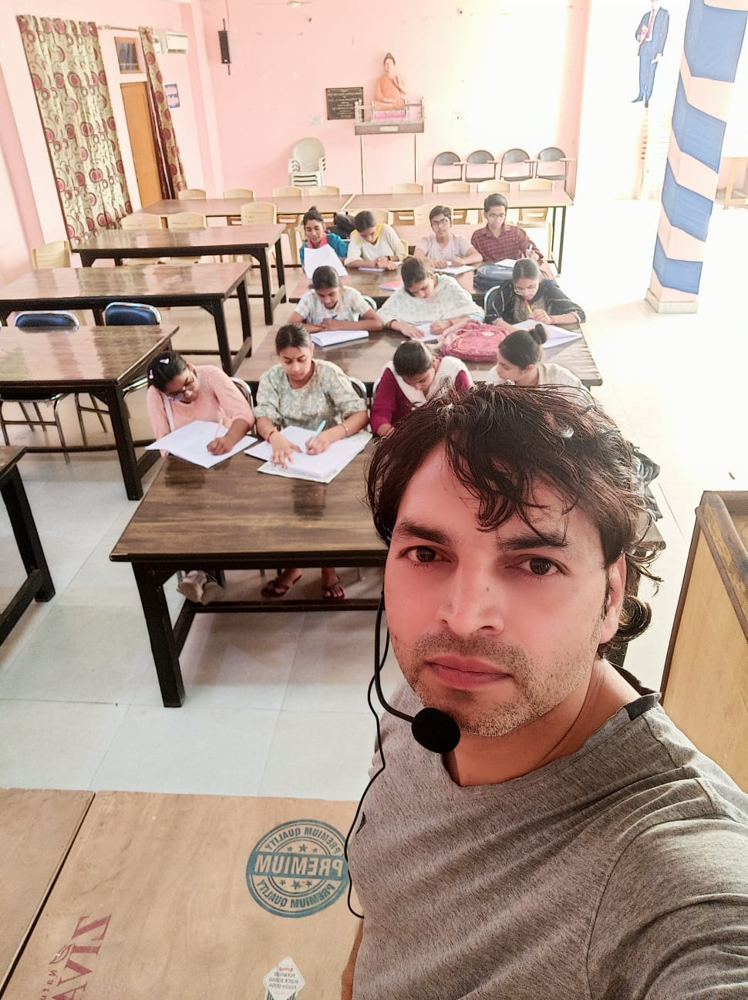{#fig-eng-class width="60%"}

Flyers for the free SARA computer & english language courses.

:::

# SARA Outreach Activities

Through these outreach activites, the SARA team has inspired students, researchers, and faculty to explore the vast potential of data-driven solutions, bridging the gap between academia and real-world applications.

## May 2024: GJU - Hisar

2 days data science workshp at the Food Technology Department at Guru Jambheshwar University, Hisar, see @fig-gju1 and @fig-gju2.

## Oct 2024: JNU - Delhi

The SARA team has been privileged to receive invitations from esteemed institutions such as **Jawaharlal Nehru University (JNU), Delhi**, see @fig-jnu1 and @fig-jnu2.

::: {#fig-unis layout-ncol=2 layout-nrow=2}

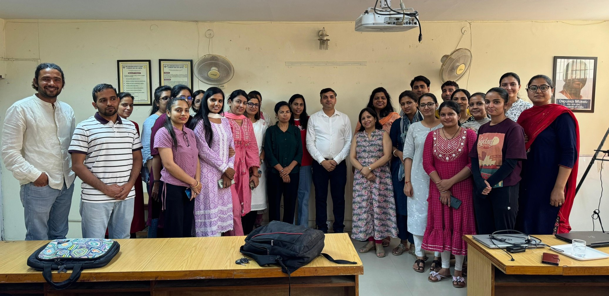{#fig-gju1}

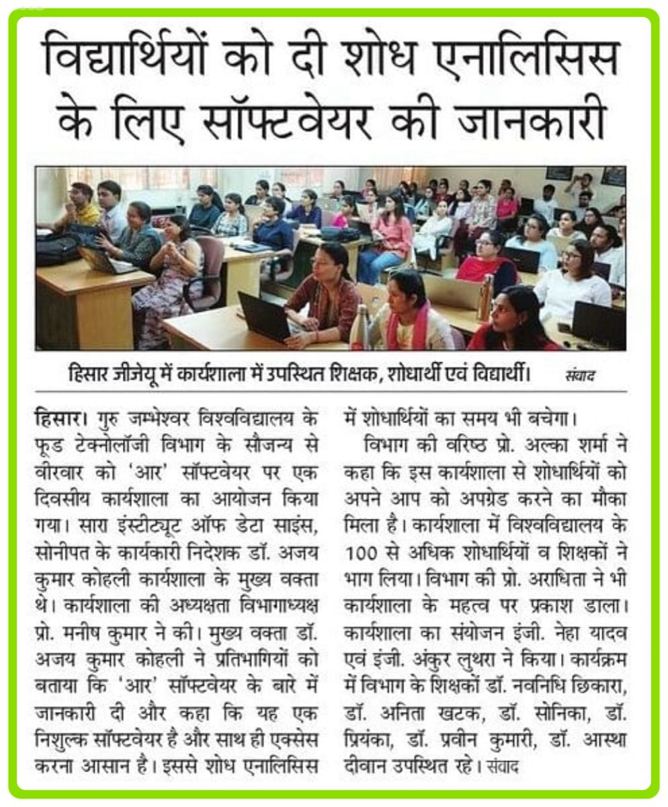{width="60%" #fig-gju2}

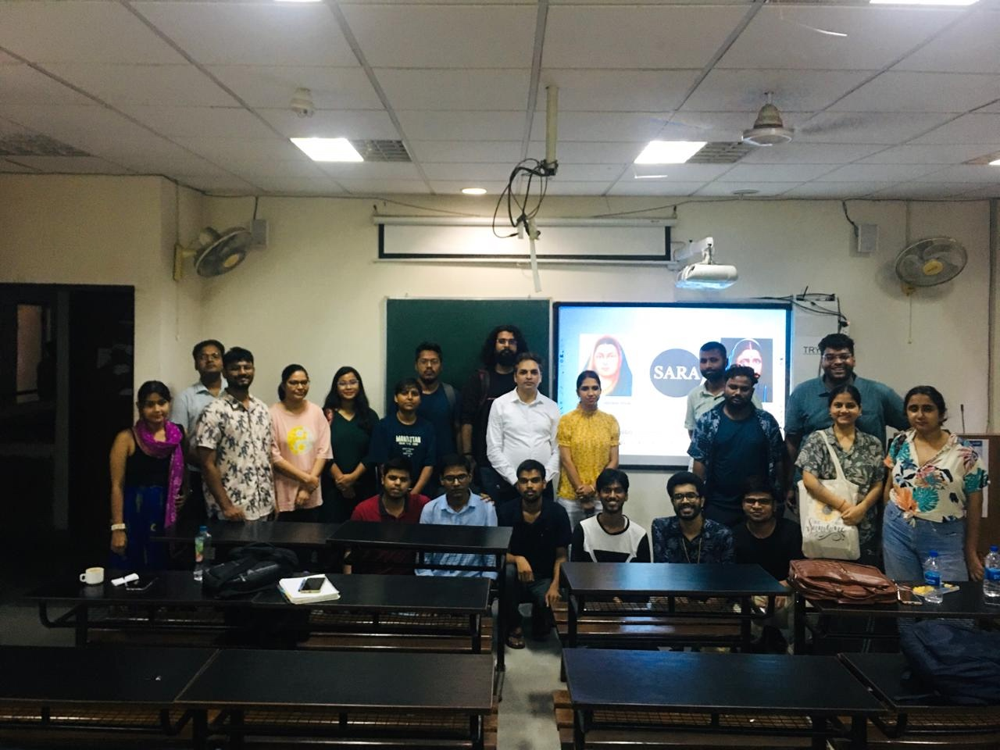{#fig-jnu1}

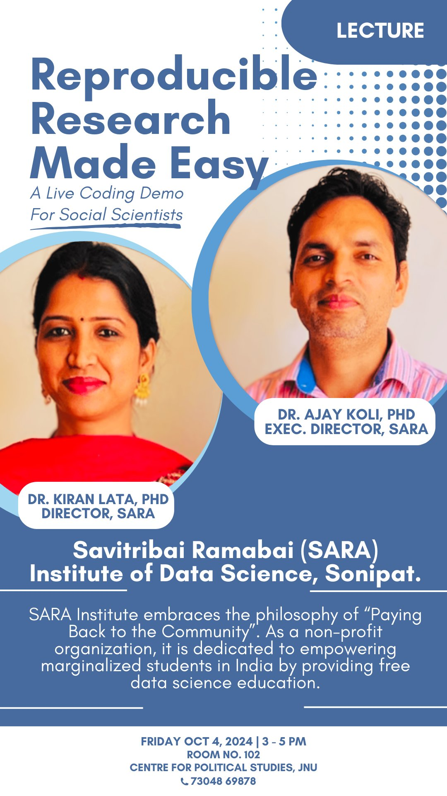{width="60%" #fig-jnu2}

Data Science Workshops Held in two government Universities.
:::

# SARA International Collaboration

In a remarkable collaboration of the SARA Institute & **BioBam Bioinformatics S.L. in Valencia, Spain** - Priyansh Srivastava (PhD student)^[https://twitter.com/spriyansh29], on 28 Oct 2024 conducted an impactful webinar for students from India. The session covered essential topics like **Molecular Biology**, **Bioinformatics**, and **Research Pathways**, offering participants valuable knowledge and direction to pursue careers in STEM. We are grateful for the partnership with collaboration. More information at this weblink: <https://intercept-mds.eu/news/priyansh-srivastava-our-esr12-explains-bioinformatics-basics-to-students-from-india/>

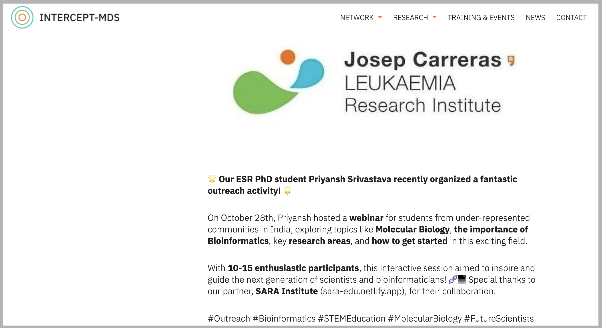

::: {#fig-unis layout-ncol=2}

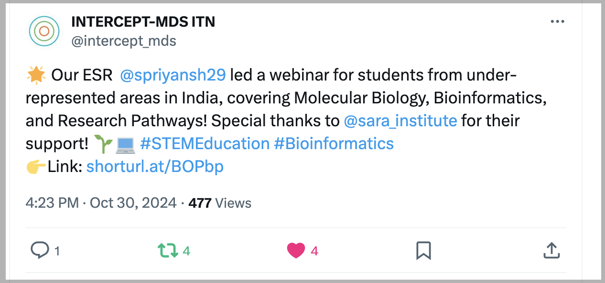{#fig-spain-tweet width=100%}

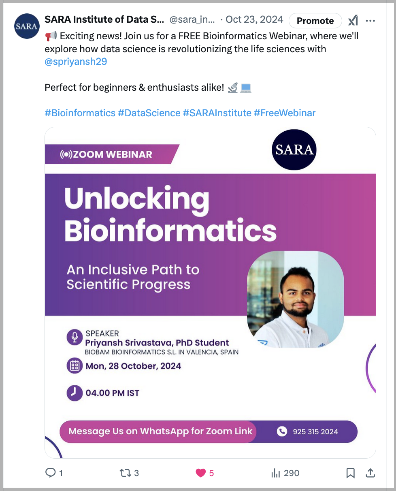{#fig-spain-talk width=100%}

International Collaboration with Spain
::: 

```{=typst}
#pagebreak()
```

```{=typst}
#line(length: 100%)
***All SARA Activities during Year 2025-26***
#line(length: 100%)
```

# 2025-26 SARA Courses

In 2025, SARA welcomed approximately **100 learners** this year, reflecting steady and meaningful growth, see @fig-2025-26-students.

**90 percent** of all admitted students came from marginalized communities - reaffirming SARA's unwavering commitment to reaching those who need these opportunities the most.

**50 percent** of the total admissions were women - a milestone that speaks to SARA's intentional work to close the gender gap in data science.

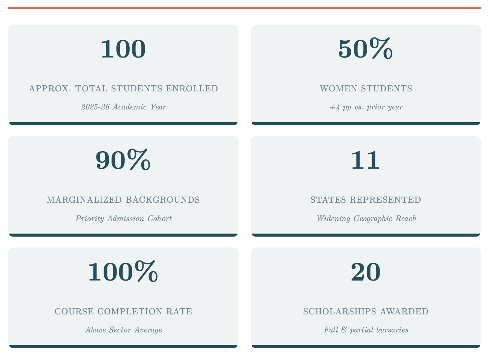{#fig-2025-26-students width="70%"}


## 2nd SARA Summer School - "R for Researchers"

_25-29 July 2025 | Offline | 40 Hours_

The second Summer School brought together researchers and students from across India to learn R - the open-source language for statistical computing. Learners came from institutions including TISS Mumbai, Delhi School of Economics, and JNU. The programme focused on hands-on experience, breaking the fear of coding, and building confidence in using R for research.

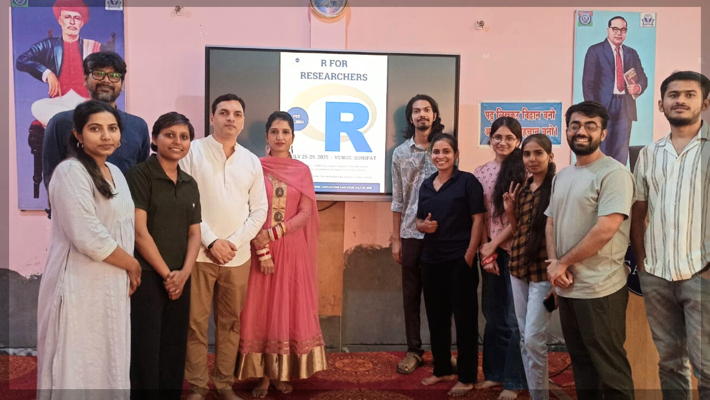{fig-align="center" width="90%"}

::: {.callout-note title="📺 Watch on YouTube"}

Participants Feedback video link: <https://www.youtube.com/watch?v=9yQFg6XTSRc>

:::

Every year, we conduct a five-day residential summer school at SARA, Sonipat.
We envision this course as a first baby step for anyone from a non-computer-science background who is trying to learn coding for the first time. The complete course is free and not-for-profit. Students are charged Rs. 3,500 only to cover five days of food and accommodation. With community support, we were also able to provide **100% fellowships to five students.**

In July 2025, we conducted the 2nd SARA Summer School -- "R for Researchers".
A total of **nine participants attended**, five of whom were female.
Most participants held post-graduation degrees in Social Sciences and Humanities.
A team of **six expert international data science educators** taught at this summer school. Dr. Ajay Koli taught offline for approximately six hours each day, and at the end of each day, an additional expert delivered an online pro-bono session of around ninety minutes. SARA is sincerely thankful to each and every instructor who generously gave their time and expertise to the students.

The SARA Summer School "R for Researchers" is an annual event aimed at first-time coders. The first day begins with the installation of R and RStudio, followed by a gradual introduction to coding syntax, data types, and how functions work in a programming language. Participants receive hands-on training in importing and cleaning datasets, followed by data visualization using ggplot2. They are also introduced to the concept of reproducible research and taught Quarto, a tool for publishing research. All sessions span approximately forty hours over five days, complemented by a daily online lecture from a data science expert.

## 2nd SARA Winter School -- "Statistics using R"
_23-27 January 2026 | Offline | 40 hours_

The Winter School trained researchers, PhD scholars, and faculty members in applied statistics using R. Participants came from institutions including Delhi University, JNU, Allahabad University, and Woxsen University. The programme was particularly valued for making complex statistical concepts accessible to those from
non-technical backgrounds.

Following the introduction to coding at the SARA Summer School, SARA offers the next step 2-3 months later: a five-day training in statistics using R. The main purpose of this Winter School is to help participants overcome their fear of statistics and numbers.

SARA conducted its 2nd Winter School "Statistics using R" from 23 to 27 January 2026.
Like the Summer School, it was completely free and not-for-profit, with a charge of Rs. 3,500 only for food and accommodation. With community support, *six participants received full fee exemptions*. Of the twenty-two registrations received, *twenty students attended* -- four female -- from diverse academic backgrounds, including working professors, three doctoral degree holders, and a majority pursuing their PhD.

Dr. Ajay Kumar Koli led the first three days of offline sessions, while *Dr. Cecilia Baldoni and Dr. Kavitha Kannan from Germany* delivered the final two days online. The sessions were engaging, with students asking thoughtful questions throughout.

Over the five days, participants covered the following modules through hands-on practice in RStudio: basics of R and data science project workflow (Day 1), descriptive statistics and data visualization using ggplot2 (Day 2), and reproducible research using Quarto (Day 3), followed by two days of online lectures on Days 4 and 5.

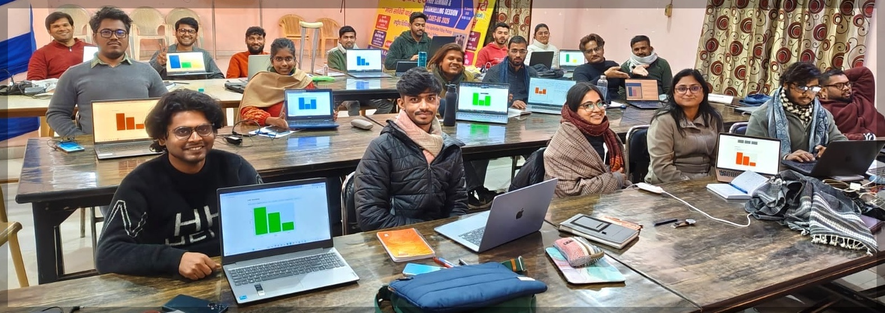{fig-align="center"}

::: {.callout-note title="📺 Watch on YouTube"}

Participants Feedback video link: <https://youtu.be/xMG_7eSmPQM?si=5YizvUrVA8ntHWiC>

:::

## 2nd SARA Coding Bootcamp - "Publish using Quarto"
_20-22 March 2026 | Offline | 30 hours_

The 2nd SARA Coding Bootcamp brought together researchers, students, and academics for three intensive days of hands-on learning - focused on how to write, format, and publish research using Quarto and R, two of the most powerful open-source tools in modern research communication.

This bootcamp was completely **free for all women participants on the occasion of International Women's Day.** No tuition. No food charges. No accommodation charges. Nothing. Just learning, growth, and community.

And today, we make a promise that goes beyond this year.

**From 2026 onwards, every SARA course held in the month of March will be completely free for all women participants - every year, without exception.**

SARA believes that research produced by and about marginalised communities must be heard. This bootcamp was built on that belief - equipping participants with the professional skills to publish their work reproducibly, credibly, and beautifully.

**What Participants Learned**

Across three carefully designed days, the bootcamp covered a full arc of modern research publishing. On Day 1, participants built their own personal websites using Quarto, GitHub, and Netlify - many for the first time. Day 2 took them into the world of reproducible academic writing, covering PhD thesis and research paper structure, PDF outputs using LaTeX and Typst, and the management of tables, figures, and data. Day 3 focused on interactive presentations using Quarto and Reveal.js, culminating in each participant building and publishing their own five-slide presentation.

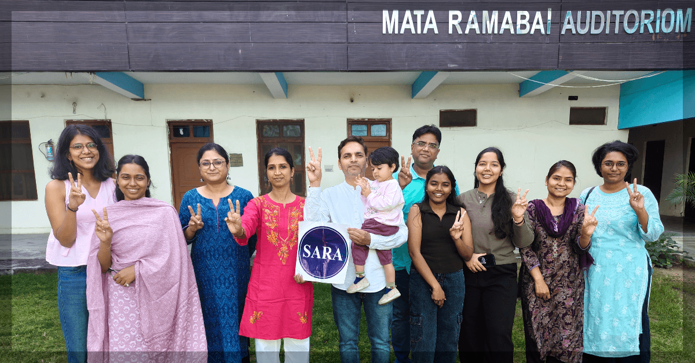{width="70%" fig-align="center"}

::: {.callout-note title="📺 Watch on YouTube"}

Participants Feedback video link: <https://youtu.be/dP3xK8nK1Q8?si=5Jl4mpOkZzwcXAAc>

:::

## Bridge Courses (2 hours per day, 12 Months)

SARA offers free courses, both offline and online, for learners at every level.

While teaching coding, we noticed that some students were uncomfortable with computers and struggled with English. So we decided to start from the basics -- building confidence in both before moving further. Throughout the year, we offer two offline courses at SARA. Any student in Class 8 or above can join.

**Computer Basic Skills** taught by Dr. Kiran Lata. Students learn to use a computer with ease. For many of our students, this is their first real introduction to a computer.

**English Language Skills** taught by Dr. Ajay Kumar Koli. Most SARA students come from humble family backgrounds and have not had the benefit of English-medium schooling. This course meets them where they are - and helps them go further.

# SARA Guest Speakers

SARA Institute of Data Science invites data scientists, researchers, and educators from across the world to join us as guest speakers at our workshops and summer schools.
An overview in @fig-guest-speakers-details and list of all speakers of year 2025-26 in @fig-guest-speakers-list.

{#fig-guest-speakers-details}

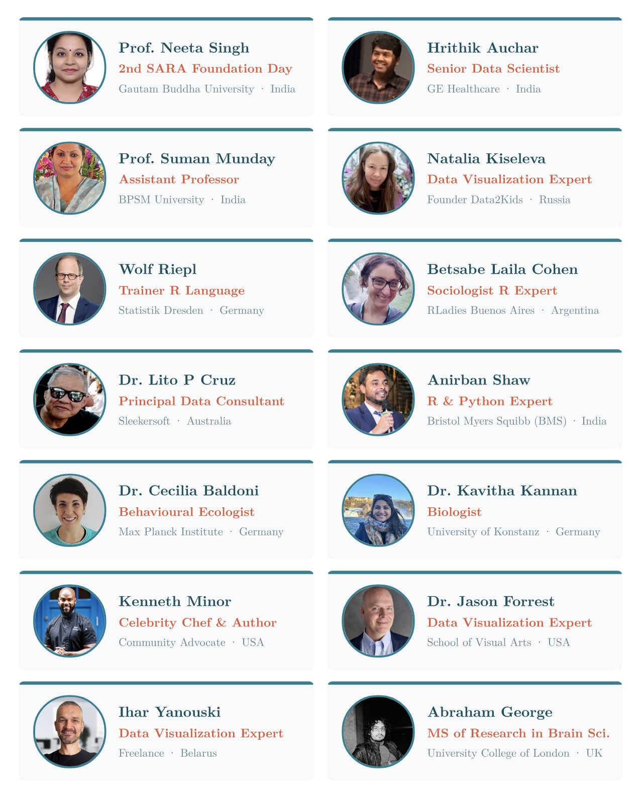{#fig-guest-speakers-list}

# SARA Collaboration & Outreach Activities

SARA believes that data science education must travel beyond its own walls.
This year, SARA partnered with universities and institutions across India to bring hands-on workshops directly to students and faculty.


-  **July 2025, Guru Jambheshwar University (GJU), Hisar** - Online sessions on EDA and Data Visualization for Social Science faculty under the Malaviya Mission Teacher Training Centre. 

- **August 2025, Institute of Development Studies (IDS), Jaipur** - Two-day capacity building workshop on R Programming for Data Analysis and Visualization for faculty and PhD scholars. IDS Jaipur is an institute of the Indian Council of Social Science Research (ICSSR), Ministry of Education, Government of India. 

- **October 2025, Talk at Department of Sociology, Delhi University** - Dr. Ajay Koli delivered a talk titled "Why Code? Unlocking New Possibilities for Social Researchers" - exploring how coding matters not just in technology, but in understanding digital society and strengthening social science research.


# Events & Community Engagement

SARA's impact extended far beyond classrooms this year, through talks, media features, and international recognition.

- **April 2025, Online Talk - "Digital Literacy for Women"** - By Prof. Dr. Suman Munday, BPSM University, Haryana - directly aligned with SARA's mission of empowering women through technology.

- **May 2025, International Recognition - Julius Maximilians University of Würzburg, Germany** - SARA's work was highlighted by the University of Würzburg, marking the institute's growing international visibility.

- **July 2025, Featured in Dainik Bhaskar** - SARA's work was covered by one of India's largest Hindi-language newspapers - amplifying its mission to a wider audience.

- **July 2025, Talk at BAPSA JNU** - Dr. Ajay Koli delivered a talk titled "Space for Marginalised Communities in AI" - discussing "coded gaze" and "algorithmic injustic".

- **Aug 2025, Online Talk - "Recognizing the Signs of Stress"** - Featuring Kenneth Minor from New York, USA - reflecting SARA's commitment to learner wellbeing alongside academic growth.

- **Oct 2025, Online Talk - "Life, Universe & Data Visualization"** - Featuring Jason Forrest from New York, USA - bringing a global perspective to data storytelling.

- **Dec 2025, IQ Leaders Qatar - Guest Lecture** - SARA's founders were invited to share SARA's mission in Doha, Qatar - followed by thoughtful discussion.

- **March 2026, Online Talk - "Your CV, Your Future"** - By Abraham George from the UK - helping learners navigate careers in data science.

- **March 2026, SBI SC/ST Employees Welfare Association - Guest Lecture** - SARA's founders were invited to speak on the transformative power of coding and technology - connecting with communities for whom SARA was built.

- **March 2026, Online Talk - "Artificial Intelligence in Research"** - Prof. Samantha MacBride from Baruch College, USA delivered this pro-bono Guest Lecture at the 2nd SARA Coding Bootcamp, March 2026.

# SARA Book Club

In 2025-26, *SARA launched its first Book Club* - a community space for reading and discussing books at the intersection of technology, society, and justice.

The inaugural book discussion featured "Unmaking AI" by Dr. Joy Buolamwini, held on 27 March 2026 - a fitting choice for a community that believes data science must be built on equity and accountability.

::: {.callout-note title="📺 Watch on YouTube"}

SARA Book Club video link: <https://youtu.be/tE8SKmrwGcU?si=N6ezYn0mjNtdxiYA>

:::

```{=typst}
#line(length: 100%)
_Report Ended_
#line(length: 100%)
```


