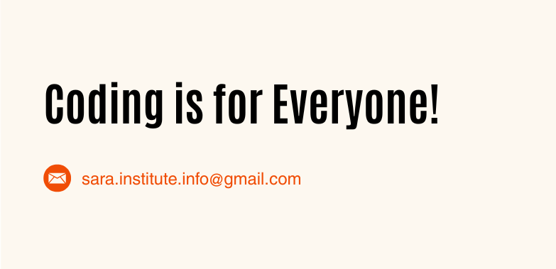
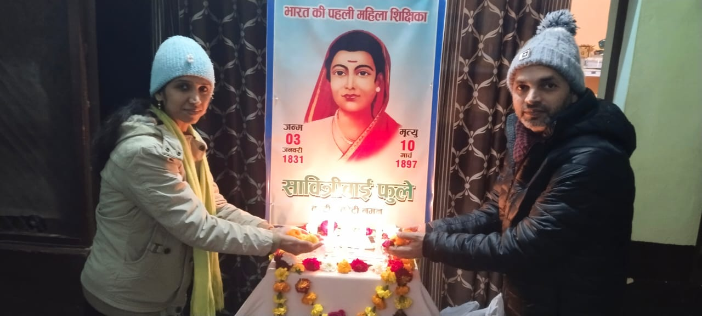

::: {.col}
::: {.card}

::: {.centering}

{fig-align="left"}

:::

Coding is for everyone. That is not a slogan. It is a belief we build on every day.

## Why SARA exists

Data science, coding, and research have been treated as skills for a privileged few - those with the right college, the right connections, the right postcode. Communities that have faced historical exclusion - by caste, by class, by geography - were handed the same closed door, again and again.

We started SARA because that is wrong. And because it is changeable.

SARA - the Institute of Data Science - exists to put the tools of the data economy into the hands of people who have been kept out of it. Not as charity. Not as a favour. But as a correction to a system that was never designed with us in mind.

### What we do

SARA offers no-cost courses in coding, data analysis, and research methods - open to anyone, no matter your background, degree, or prior experience.

Our courses are designed to be learnable from where you are. No expensive software. No prerequisite qualifications. No gatekeeping.

We teach skills that are in real demand - R, Python, statistics, data visualisation, research design - and we teach them in a way that respects the intelligence of every learner who walks through our door.

:::
:::

 

::: {.col}
::: {.card}

::: {.centering}

:::

## Who We Are

**The SARA Education Trust (Registered)** was founded by Dr. Ajay and Dr. Kiran, along with seven trustees, with the vision to transform education and make learning accessible to all. Their unwavering commitment led to the establishment of the **Savitribai Ramabai (SARA) Institute of Data Science** in April 2023.  

**Dr. Ajay Kumar Koli**, a Ph.D. in Management Studies from the University of Hyderabad, has extensive experience teaching Market Research and Research Methodologies as an Assistant Professor in Pune. **Dr. Kiran Lata**, a Ph.D. in Dairy Chemistry from NDRI - Karnal, has published over fifteen research papers in food technology and brings years of academic and research experience as an Assistant Professor.  

At SARA, they believe in breaking barriers to education. The institute offers **tuition-free courses** in data science, computer skills, English language proficiency, and research methodologies, ensuring that quality education is accessible to all.  

Currently based in Sonipat, Dr. Ajay and Dr. Kiran reside in a rented house, passionately dedicating themselves to the growth of SARA while embracing their roles as educators and proud parents to their beautiful daughter.  

Their journey is made possible through the invaluable support of **The Ambedkar Educational Society, Sonipat**, which generously provides the space at the esteemed Dr. Ambedkar Bhawan for conducting SARA's classes.  

With a steadfast commitment to inclusivity and excellence, Dr. Ajay and Dr. Kiran continue to inspire and empower students, fostering a brighter and more equitable future through the educational initiatives at SARA Institute.  

:::
:::

 
