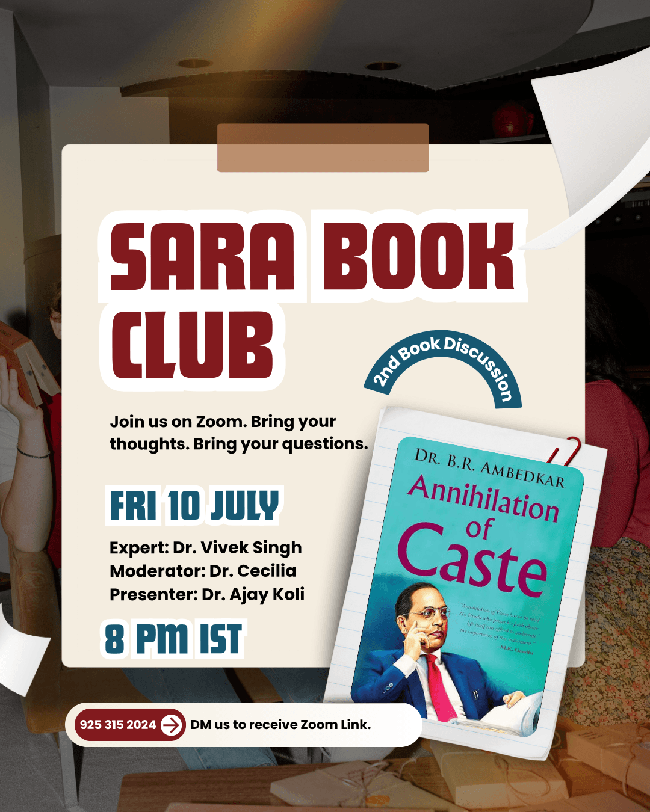

The SARA Book Club returns for its second session with one of the most important texts in Indian intellectual history - Dr. B.R. Ambedkar's Annihilation of Caste. Written in 1936 and as urgent as ever, this book challenges us to confront the foundations of caste society and imagine a world beyond it.

The session will feature a **presenter, [Dr. Ajay Koli](https://www.linkedin.com/in/ajay-kumar-koli/),**  who will walk us through the key arguments of the text, a **subject expert [Dr. Vivek Kumar Singh](https://www.linkedin.com/in/vivek-kumar-singh-jnu/)** who will offer deeper context and insight, and a **moderator [Dr. Cecilia Baldoni](https://www.linkedin.com/in/cecilia-baldoni/)** to guide an open and thoughtful discussion. Whether you have read every word or are coming to Ambedkar for the first time, you are welcome at this table.

---------

🗓 Date: 10 July 2026

🕐 Time: 8 PM IST

💻 Platform: Zoom

**✉️ Email us to receive Zoom Link:** [sara.institute.info@gmail.com](mailto:sara.institute.info@gmail.com)

---------

The discussion will be held on Zoom. To receive your meeting link, please contact SARA directly. The session will be recorded and uploaded to the [SARA YouTube channel](https://www.youtube.com/@SARADataScience), so those who cannot join live can watch at their own time.

Join us. Read, question, and discuss - because education that does not disturb the comfortable is not education at all.

