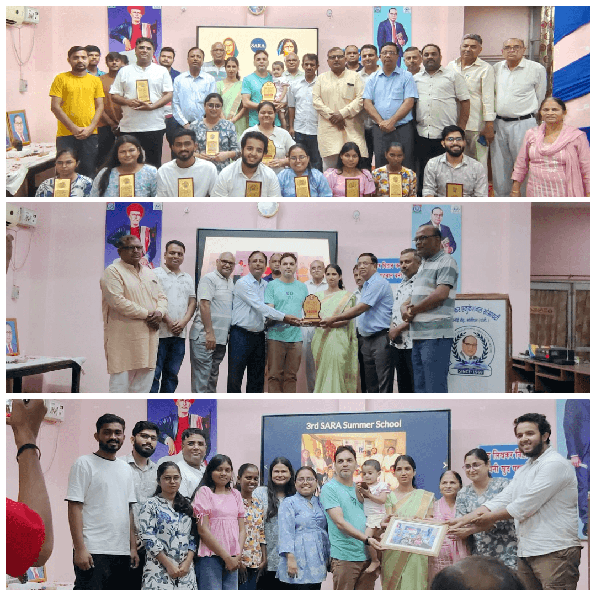
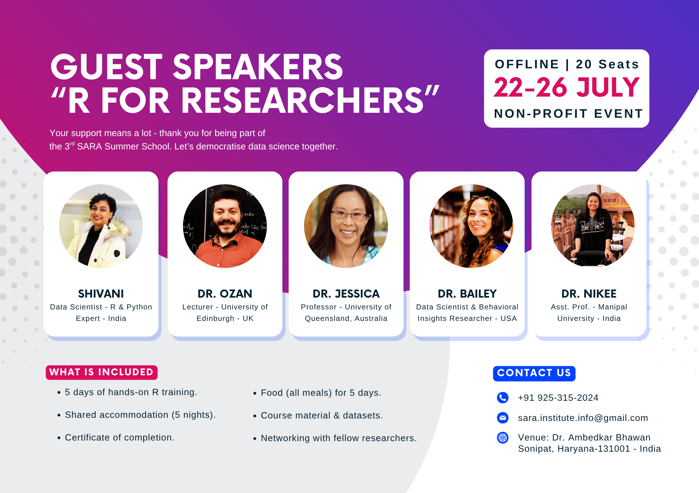
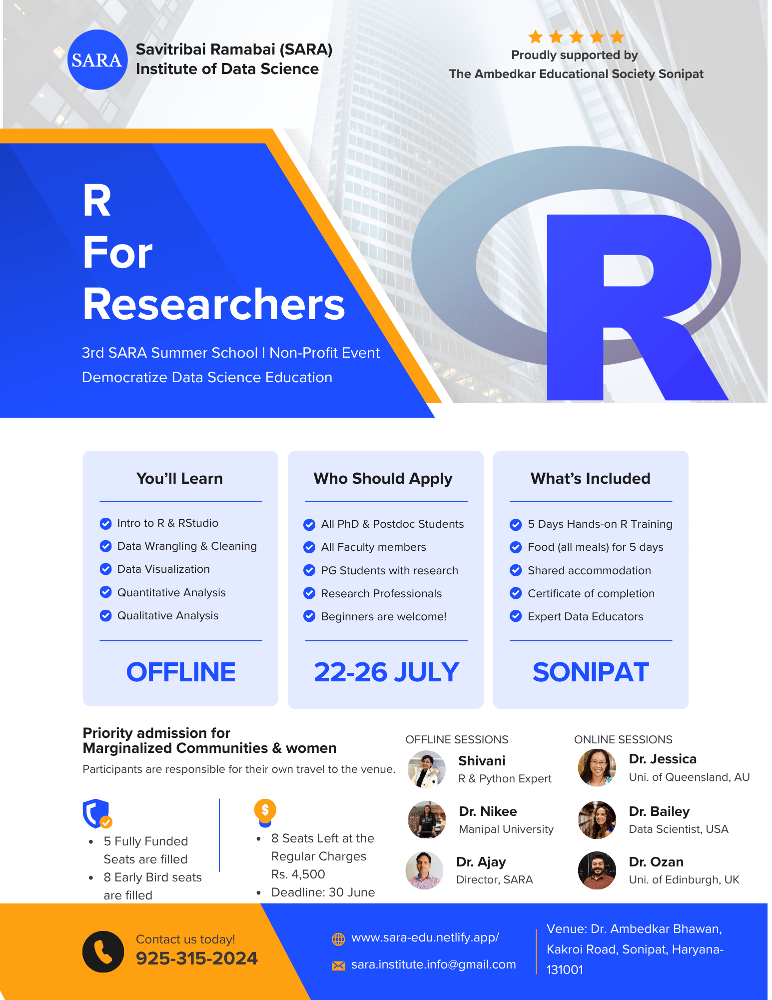

## About the Summer School

We are excited to announce the **3rd SARA Summer School on R for Researchers** -- a five-day intensive, hands-on workshop designed to equip researchers with practical R programming skills for data analysis, visualisation, and reproducible research.

This is a **non-profit event with no tuition fee**. Participants only contribute toward food and accommodation. A limited number of fully funded seats are available for deserving applicants.

Whether you are new to R or looking to sharpen your analytical toolkit, this summer school offers an immersive learning experience with expert instructor in a collaborative setting.

### 📺 Watch Highlights



 

### 📺 Watch Prof. Jessica Mar Session



 

### 📺 Watch Dr. Ozan Evkaya Session



---

## What You will Learn 

::: {.callout-note icon=false}
### Lecture Modules at a Glance

| Detail | Value |
|--------|-------|
| **Day 1** | Introduction to R & RStudio  |
| **Day 2** | Data Import, Wrangling & Cleaning |
| **Day 3** | Data Visualization & Exploratory Analysis |
| **Day 4** | Statistical Analysis & Reproducible Research |
| **Day 5** | Qualitative/Text Analysis & Sentiment Analysis |

:::

## What's Included

- 5 days of hands-on R training
- Food (all meals) for 5 days
- Shared accommodation (5 nights)
- Course materials &amp; datasets
- Certificate of completion
- Networking with fellow researchers

## Who Should Apply

- Researchers, PhD students, and postdocs in any discipline
- Faculty members looking to incorporate R into their teaching or research
- Graduate students with a research component in their programme
- Professionals in research-adjacent roles (public health, policy, analytics)
- No prior programming experience required — beginners are welcome

## Apply Now

**Refund policy:** Cancellations on or before 30 June 2026 are eligible for a 50% refund. No refund will be issued after this date. Funded seats carry no monetary refund.

