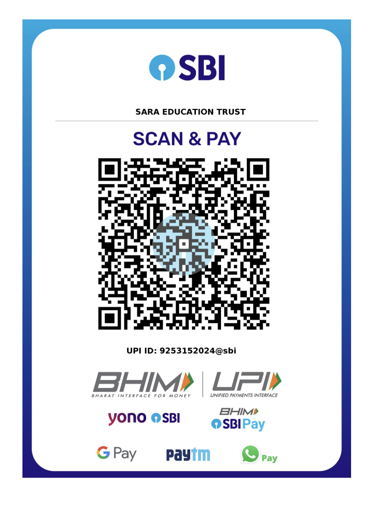

  <iframe loading="lazy" style="position: absolute; width: 100%; height: 100%; top: 0; left: 0; border: none; padding: 0;margin: 0;"
    src="https://www.canva.com/design/DAG66iABn8g/NrZdL6ssJrNzRFvBMVhB6g/view?embed" allowfullscreen="allowfullscreen" allow="fullscreen">
  </iframe>

## About the Program

SARA Institute of Data Science, an Ambedkarite non-profit educational trust based in Sonipat, Haryana, presents its 3rd Winter School - a five-day, hands-on introduction to statistics using R, designed specifically for first-generation learners from Social Science and Humanities backgrounds.

In line with SARA's mission of building data science capacity among first-generation and Dalit-Bahujan learners, this program is offered at a nominal, need-based fee, with waivers available on request - because access to quantitative skills should never depend on one's ability to pay.

## Program Details

|  |  |
|-------------------------|-----------------------------------------------|
| **Dates** | 20–24 November 2026 (Friday to Tuesday |
| **Duration** | 5 days, approximately 40 instructional hours |
| **Mode** | Offline |
| **Venue** | Dr. Ambedkar Bhawan, Sonipat, Haryana |
| **Seats** | Limited to 25 participants |
| **Fee** | ₹5,000 (includes all meals and shared accommodation for 5 days) |
| **Fee Waiver** | Available on request, no questions asked |
| **Eligibility** | Open to students and early researchers from Social Science and Humanities backgrounds — no prior coding or statistics experience required |

## Curriculum Overview

The program is structured to take complete beginners to a confident working knowledge of statistical analysis in R, using examples drawn from real social issues throughout.

**Day 1 - Foundations** Introduction to R and RStudio; descriptive statistics (mean, median, mode, spread)

**Day 2 - Date Visualization** Working with categorical and numerical data; data visualization; reading and interpreting distributions

**Day 3 - Probability & Sampling** Foundations of probability; the normal distribution; sampling methods and survey design

**Day 4 - Inferential Statistics** Hypothesis testing; confidence intervals; t-tests and chi-square tests

**Day 5 - Relationships & Regression** Correlation and regression; a hands-on applied research project; closing session on research ethics

Each day combines conceptual teaching with hands-on practice in R, using datasets relevant to education, employment, gender, and social policy.

## Speakers

All sessions will be taught by SARA faculty (Dr. Ajay Kumar Koli) along with pro bono online guest speakers and researchers who apply R and statistics in their own work, offering participants real, research-driven examples of how these tools are used to answer meaningful questions.

*(Speaker names and profiles will be updated as confirmed.)*

## Why Statistics Matters for Social Science & Humanities Students

Statistics is often assumed to belong to the sciences alone - but it is increasingly central to research, policy, and public discourse across every discipline.

-   **Data now shapes research and policy.** Understanding disparities in education, employment, health, and caste-based inequality increasingly requires the ability to read, question, and analyze data.

-   **Quantitative literacy has historically been gatekept.** SARA believes these tools should be accessible to every student, regardless of economic or educational background.

-   **It strengthens critical thinking.** Learning statistics teaches students to question claims, identify misleading data, and understand the real limits of a survey or study - a skill essential well beyond any single field.

-   **It expands opportunity.** From research assistantships to policy work to postgraduate study, foundational statistical literacy is increasingly expected - this program aims to ensure SARA's students are not left behind.

## Who Should Apply

Any student or early researcher from a Social Science or Humanities background is welcome to apply. No prior statistics or programming experience is required - only curiosity.

## How to Register

**Take Screen Shot of Bank Transfer or UPI Payment:**

Account Name: SARA EDUCATION TRUST        
Account Number: `42920911856`  
Bank Name: STATE BANK OF INDIA, Sonipat               
IFSC Code: `SBIN0000721`

{width="50%"}

### Registration link: <https://forms.gle/tdzyssw6F3CmtVjB8>

## Cancellation & Refund Policy

Since seats are limited and SARA commits in advance to catering and accommodation arrangements, the following refund policy applies:

|Cancellation Window                             | Refund      |
|------------------------------------------------|-------------|
|On or before 23 October 2026 (4+ weeks before)  | 100% refund |
|24 October – 6 November 2026 (2–4 weeks before) | 50% refund  |
|After 7 November 2026 (less than 2 weeks before)| No refund   |

**Seat Transfer:** If you're unable to attend, you may transfer your seat to another eligible participant at any time before the program begins, at no additional cost.

**Exceptional Circumstances:** In cases of genuine medical or family emergencies, please reach out to us directly - exceptions may be considered at SARA's discretion.

**Waitlist:** Any cancelled seat will be offered to participants on the waitlist, in order of registration.

For cancellations or queries, please contact us at `sara.institute.info@gmail.com` or call at `925 315 2024`.